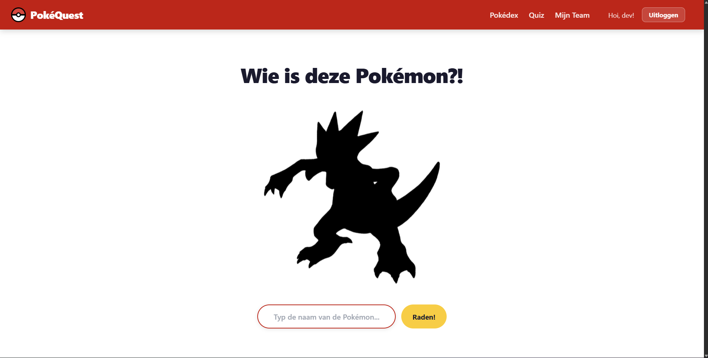

# PokéQuest

## Inhoudsopgave

- [Inleiding](#inleiding)
- [Screenshot](#screenshot)
- [Technieken en frameworks](#technieken-en-frameworks)
- [Vereisten](#vereisten)
- [Project lokaal opzetten](#project-lokaal-opzetten)
- [Inloggegevens](#inloggegevens)
- [Beschikbare npm-commando's](#beschikbare-npm-commandos)

---

## Inleiding

PokéQuest is een interactieve Pokémon-webapplicatie waarmee je jouw Pokémon-kennis kunt testen, je gevangen Pokémon kunt beheren en een eigen team kunt samenstellen.

**Belangrijkste functionaliteiten:**

- **Quiz** - Zie een silhouet en raad welke Pokémon het is. Raad je het goed? Dan wordt de Pokémon aan je Pokédex toegevoegd.
- **Pokédex** - Bekijk alle Pokémon die je ooit goed hebt geraden. Filter op naam of type.
- **Detail** - Druk vanuit de Pokédex pagina op een Pokémon op zijn gegevens te bekijken.
- **Team** - Stel een team samen van maximaal 6 Pokémon. Voeg Pokémon toe vanuit de Pokédex of direct na het raden in de quiz, en verwijder ze wanneer je wilt.
- **Accounts** - Registreer een account en log in. Je voortgang (gevangen Pokémon en team) wordt gekoppeld aan jouw account en blijft bewaard.

---

## Screenshot

Dit is een screenshot van de Quiz pagina.



---

## Technieken en frameworks

| Techniek / Framework | Versie | Omschrijving |
|---|---|---|
| [React](https://react.dev/) | 19 | JavaScript-bibliotheek voor het bouwen van de gebruikersinterface |
| [Vite](https://vitejs.dev/) | 8 | Build-tool en ontwikkelserver |
| [React Router DOM](https://reactrouter.com/) | 7 | Client-side routing (navigatie tussen pagina's) |
| [Axios](https://axios-http.com/) | 1.x | HTTP-bibliotheek voor API-aanroepen |
| [React Hook Form](https://react-hook-form.com/) | 7 | Formuliervalidatie (login- en registratieformulier) |
| [JWT Decode](https://github.com/auth0/jwt-decode) | 4 | Decoderen van de JWT-token na inloggen |
| [PokeAPI](https://pokeapi.co/) | v2 | Gratis publieke API voor Pokémon-data |
| [NOVI Backend API](https://novi-backend-api-wgsgz.ondigitalocean.app) | — | Backend voor gebruikersaccounts, gevangen Pokémon en teams |

---

## Vereisten

Zorg dat de volgende software op jouw computer staat geïnstalleerd:

- **Node.js** versie 20 of hoger — download via [nodejs.org](https://nodejs.org/)
- **npm** (wordt meegeleverd met Node.js)

Controleer of Node.js correct is geïnstalleerd door dit commando in je terminal te draaien:

```bash
node -v
```

---

## Project lokaal opzetten

### Stap 1 - Kloon of download het project

Als je Git hebt geïnstalleerd, kloon het project met:

```bash
git clone https://github.com/geygrill/pokequest.git
cd pokequest
```

Of download de `.zip` via GitHub en pak hem uit.

### Stap 2 - Installeer de afhankelijkheden

Ga in je terminal naar de projectmap en voer het volgende commando uit:

```bash
npm install
```

Dit installeert alle benodigde pakketten die in `package.json` staan.

### Stap 3 - Configureer de omgevingsvariabelen

De applicatie gebruikt een .env-bestand voor de API-configuratie. Dit bestand staat al in de repository met het juiste Project ID:
```
NOVI_PROJECT_ID=15434519-3993-48e6-93d6-56bf22754409
```

### Stap 4 - Start de applicatie

Start de ontwikkelserver met:

```bash
npm run dev
```

De applicatie is nu bereikbaar op [http://localhost:3000](http://localhost:3000).

> Om de Novi API te kunnen bereiken moet het project draaien op port 3000 of 5173, pas vite.config.js aan indien nodig.

---

## Inloggegevens

Er is een testaccount beschikbaar om de applicatie direct te kunnen uitproberen:

| E-mailadres         | Wachtwoord |
|---------------------|------------|
| `test@pokequest.nl` | `test123`  |

Je kunt ook zelf een nieuw account aanmaken via de **Registreren**-knop in de navigatiebalk.

> Als dit account niet (meer) werkt, maak dan eenvoudig een nieuw account aan via de registratiepagina.

---

## Beschikbare npm-commando's

| Commando | Omschrijving |
|----------|-------------|
| `npm run dev` | Start de development server met automatisch herladen bij wijzigingen (HMR) |
| `npm run build` | Bouwt een geoptimaliseerde productieversie van de applicatie in de map `dist/` |
| `npm run preview` | Start een lokale server om de productie-build te bekijken (voer eerst `npm run build` uit) |
| `npm run lint` | Controleert de broncode op stijl- en kwaliteitsfouten met ESLint |